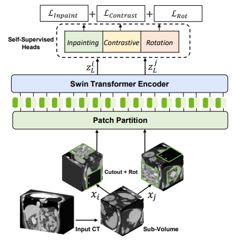

# Descripción general del modelo

Este repositorio contiene el código para el pre-entrenamiento _self-supervised_ del modelo Swin UNETR [1] para la segmentación de imágenes médicas. Swin UNETR es el conjunto de datos de desafío de segmentación de última generación en Medical Segmentation Decathlon (MSD) y Beyond the Cranial Vault (BTCV). La arquitectura de Swin UNETR se ilustra a continuación:


Para el pre-entrenamiento _self-supervised_, los tokens recortados aleatoriamente se aumentan con diferentes transformaciones, como rotación y recorte, y se usan para tareas pretexto, como _inpainting_ del volumen enmascarado, _contrastive learning_ y rotación. Se presenta una descripción general del marco de pre-entrenamiento en la siguiente imagen:



A continuación se muestra una animación de imágenes originales (izquierda) y sus reconstrucciones (derecha):


# Instalación de dependencias

Las dependencias se pueden instalar usando:

```bash
pip install -r requirements.txt
```

# Modelos Pre-entrenados

Proporcionamos los pesos pre-entrenados _self-supervised_ para el _backbone_ Swin UNETR (paper CVPR [1]) en este <a href="https://github.com/Project-MONAI/MONAI-extra-test-data/releases/download/0.8.1/model_swinvit.pt">link</a>.
A continuación, describimos los pasos para pre-entrenar el modelo desde cero.

# Datasets

Los siguientes catasets se utilizaron para el pre-entrenamiento (~5050 imágenes 3D CT). Descargue los archivos json correspondientes de cada dataset para obtener más detalles y colóquelos en la carpeta `jsons`:

- Head & Neck Squamous Cell Carcinoma (HNSCC) ([Link](https://wiki.cancerimagingarchive.net/display/Public/HNSCC)) ([Download json](https://github.com/Project-MONAI/MONAI-extra-test-data/releases/download/0.8.1/dataset_HNSCC_0.json))
- Lung Nodule Analysis 2016 (LUNA 16) ([Link](https://luna16.grand-challenge.org/Data/)) ([Download json](https://github.com/Project-MONAI/MONAI-extra-test-data/releases/download/0.8.1/dataset_LUNA16_0.json))
- TCIA CT Colonography Trial ([Link](https://wiki.cancerimagingarchive.net/display/Public/CT+COLONOGRAPHY/)) ([Download json](https://github.com/Project-MONAI/MONAI-extra-test-data/releases/download/0.8.1/dataset_TCIAcolon_v2_0.json))
- TCIA Covid 19 ([Link](https://wiki.cancerimagingarchive.net/display/Public/CT+Images+in+COVID-19/)) ([Download json](https://github.com/Project-MONAI/MONAI-extra-test-data/releases/download/0.8.1/dataset_TCIAcovid19_0.json))
- TCIA LIDC ([Link](https://wiki.cancerimagingarchive.net/display/Public/LIDC-IDRI/)) ([Download json](https://github.com/Project-MONAI/MONAI-extra-test-data/releases/download/0.8.1/dataset_LIDC_0.json))

# Entrenamiento

## Pre-entrenamiento distribuido Multi-GPU

Para pre-entrenar un encoder `Swin UNETR` usando multi-gpus:

```bash
python -m torch.distributed.launch --nproc_per_node=<Num-GPUs> --master_port=11223 main.py
--batch_size=<Batch-Size> --num_steps=<Num-Steps> --lrdecay --eval_num=<Eval-Num> --logdir=<Exp-Num> --lr=<Lr>
```

Lo siguiente se utilizó para pre-entrenar un Swin UNETR en 8 X 32G V100 GPUs:

```bash
python -m torch.distributed.launch --nproc_per_node=8 --master_port=11223 main.py
--batch_size=1 --num_steps=100000 --lrdecay --eval_num=500 --lr=6e-6 --decay=0.1
```

## Pre-entrenamiento con Gradient Check-pointing usando una sola GPU

Para pre-entrenar un encoder `Swin UNETR` usando una sola GPU con Gradient Check-pointing y un tamaño de parche específico:

```bash
python main.py --use_checkpoint --batch_size=<Batch-Size> --num_steps=<Num-Steps> --lrdecay
--eval_num=<Eval-Num> --logdir=<Exp-Num> --lr=<Lr> --roi_x=<Roi_x> --roi_y=<Roi_y> --roi_z=<Roi_z>
```

# Citación

Si encuentra útil este repositorio, considere citar el paper de Swin UNETR:

```
@inproceedings{tang2022self,
  title={Self-supervised pre-training of swin transformers for 3d medical image analysis},
  author={Tang, Yucheng and Yang, Dong and Li, Wenqi and Roth, Holger R and Landman, Bennett and Xu, Daguang and Nath, Vishwesh and Hatamizadeh, Ali},
  booktitle={Proceedings of the IEEE/CVF Conference on Computer Vision and Pattern Recognition},
  pages={20730--20740},
  year={2022}
}

@article{hatamizadeh2022swin,
  title={Swin UNETR: Swin Transformers for Semantic Segmentation of Brain Tumors in MRI Images},
  author={Hatamizadeh, Ali and Nath, Vishwesh and Tang, Yucheng and Yang, Dong and Roth, Holger and Xu, Daguang},
  journal={arXiv preprint arXiv:2201.01266},
  year={2022}
}
```

# Referencias

[1]: Tang, Y., Yang, D., Li, W., Roth, H.R., Landman, B., Xu, D., Nath, V. and Hatamizadeh, A., 2022. Self-supervised pre-training of swin transformers for 3d medical image analysis. In Proceedings of the IEEE/CVF Conference on Computer Vision and Pattern Recognition (pp. 20730-20740).

[2]: Hatamizadeh, A., Nath, V., Tang, Y., Yang, D., Roth, H. and Xu, D., 2022. Swin UNETR: Swin Transformers for Semantic Segmentation of Brain Tumors in MRI Images. arXiv preprint arXiv:2201.01266.
