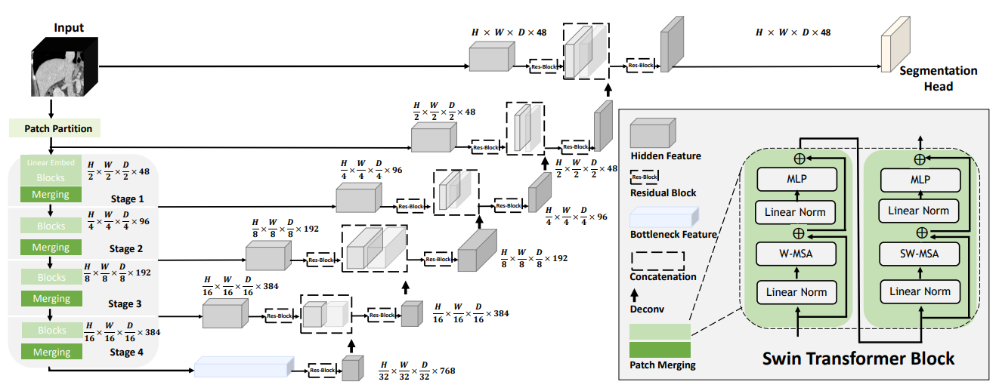
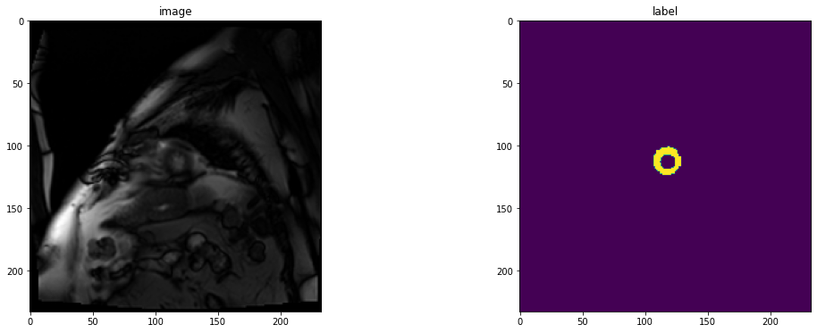
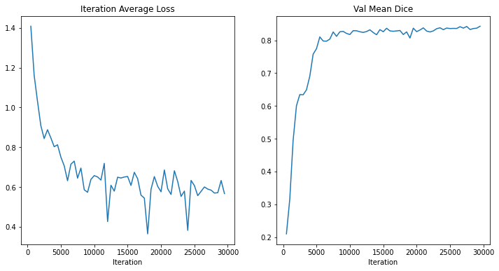
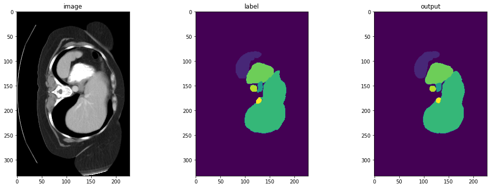

# Segmentación 3D Multiórgano con Swin UNETR (BTCV Challenge)

Este tutorial utiliza un modelo Swin UNETR para la tarea de segmentación de múltiples órganos utilizando el conjunto de datos de desafío BTCV. La arquitectura de Swin UNETR se muestra a continuación


Las siguientes características están incluidas en este tutorial:

1. Transformaciones para datos en formato de diccionario.
2. Defina una nueva transformación de acuerdo con la API de transformación de MONAI.
3. Cargue la imagen de Nifti con metadatos, cargue una lista de imágenes y apílelas.
4. Ajuste aleatoriamente la intensidad para el aumento de datos.
5. Caché IO y transformaciones para acelerar el entrenamiento y la validación.
6. Modelo Swin UNETR, función de pérdida DiceCE, métrica Mean Dice para tareas de segmentación de múltiples órganos.

Para este tutorial, el conjunto de datos debe descargarse de:
<https://www.synapse.org/#!Synapse:syn3193805/wiki/217752>.

Para el conjunto de datos de BTCV, bajo la supervisión de la Junta de Revisión Institucional (IRB), se seleccionaron aleatoriamente 50 tomografías computarizadas de abdomen de una combinación de un ensayo de quimioterapia de cáncer colorrectal en curso y un estudio retrospectivo de hernia ventral. Los 50 escaneos se capturaron durante la fase de contraste venoso portal con tamaños de volumen variables (512 x 512 x 85 - 512 x 512 x 198) y campo de visión (aprox. 280 x 280 x 280 mm3 - 500 x 500 x 650 mm3). La resolución en el plano varía de 0,54 x 0,54 mm2 a 0,98 x 0,98 mm2, mientras que el grosor del corte varía de 2,5 mm a 5,0 mm.

Objetivo: 13 órganos abdominales, incluidos 1. Bazo 2. Riñón derecho 3. Riñón izquierdo 4. Vesícula biliar 5. Esófago 6. Hígado 7. Estómago 8. Aorta 9. VCI 10. Venas porta y esplénica 11. Páncreas 12 Glándula suprarrenal derecha 13 Izquierda glándula suprarrenal.

Modalidad: CT Tamaño: 30 volúmenes 3D (24 Entrenamiento + 6 Pruebas)

Reto: BTCV MICCAI

La siguiente figura muestra parches de imagen con las subregiones de órganos que están anotadas en la TC (arriba a la izquierda) y las etiquetas finales para todo el conjunto de datos (derecha).

Los datos, cifras y recursos proceden de:

1.  [Self-Supervised Pre-Training of Swin Transformers for 3D Medical Image Analysis](https://arxiv.org/abs/2111.14791)

2.  [Swin UNETR: Swin Transformers for Semantic Segmentation of Brain Tumors in MRI Images](https://arxiv.org/abs/2201.01266)

3.  [High-resolution 3D abdominal segmentation with random patch network fusion (MIA)](https://www.sciencedirect.com/science/article/abs/pii/S1361841520302589)

4.  [Efficient multi-atlas abdominal segmentation on clinically acquired CT with SIMPLE context learning (MIA)](https://www.sciencedirect.com/science/article/abs/pii/S1361841515000766?via%3Dihub)


Los parches de imagen muestran anatomías de un sujeto, que incluyen:

1. órganos grandes: bazo, hígado, estómago.
2. Órganos más pequeños: vesícula biliar, esófago, riñones, páncreas.
3. Tejidos vasculares: aorta, IVC, venas P&S.
4. Glándulas: glándula suprarrenal izquierda y derecha

Si encuentra útil este tutorial, considere citar \[1\] y [2](Hatamizadeh,%20A.,%20Nath,%20V.,%20Tang,%20Y.,%20Yang,%20D.,%20Roth,%20H.%20and%20Xu,%20D.,%202022.%20Swin%20UNETR:%20Swin%20Transformers%20for%20Semantic%20Segmentation%20of%20Brain%20Tumors%20in%20MRI%20Images.%20arXiv%20preprint%20arXiv:2201.01266.):

\[1\]: Tang, Y., Yang, D., Li, W., Roth, H.R., Landman, B., Xu, D.,
Nath, V. and Hatamizadeh, A., 2022. Self-supervised pre-training of swin
transformers for 3d medical image analysis. In Proceedings of the
IEEE/CVF Conference on Computer Vision and Pattern Recognition (pp.
20730-20740).

[](https://colab.research.google.com/github/HiroForYou/Vision-2-Transformers/blob/main/ViT-in-medical-imaging/swin_unetr_btcv_segmentation_3d.ipynb)

# Swin UNETR Encoder pre-entrenado

Usamos pesos del entrenamiento previo autosupervisado del codificador Swin UNETR (3D Swin Transformador) en una cohorte de 5050 tomografías computarizadas de conjuntos de datos disponibles públicamente. El codificador se entrena previamente mediante tareas previas al texto de reconstrucción, predicción de rotación y aprendizaje contrastivo, como se muestra abajo. Para obtener más detalles, consulte \[1\] (documento CVPR) y consulte este [repositorio](https://github.com/Project-MONAI/research-contributions/tree/main/SwinUNETR/Pretrain).


Descargue los pesos preentrenados de este [link](https://github.com/Project-MONAI/MONAI-extra-test-data/releases/download/0.8.1/model_swinvit.pt) y colóquelo en el directorio raíz de este tutorial.

Si desea recibir capacitación desde cero, omita el paso de
inicialización a partir de pesos pre-entrenados.

## Configuración del entorno

```python
!pip install git+https://github.com/Project-MONAI/MONAI#egg.gitmonai@0.8.1+271.g07de215c
!pip install nibabel==3.1.1
!pip install tqdm==4.63.0
```

```python
!python -c "import matplotlib" || pip install -q matplotlib
%matplotlib inline
```

```python
import os
import shutil
import tempfile

import matplotlib.pyplot as plt
import numpy as np
from tqdm import tqdm

from monai.losses import DiceCELoss
from monai.inferers import sliding_window_inference
from monai.transforms import (
    AsDiscrete,
    AddChanneld,
    Compose,
    CropForegroundd,
    LoadImaged,
    Orientationd,
    RandFlipd,
    RandCropByPosNegLabeld,
    RandShiftIntensityd,
    ScaleIntensityRanged,
    Spacingd,
    RandRotate90d,
    ToTensord,
)

from monai.config import print_config
from monai.metrics import DiceMetric
from monai.networks.nets import SwinUNETR

from monai.data import (
    DataLoader,
    CacheDataset,
    load_decathlon_datalist,
    decollate_batch,
)


import torch

print_config()
```

MONAI version: 0.9.0+29.gb45794ab
Numpy version: 1.23.0
Pytorch version: 1.8.2+cu102
MONAI flags: HAS_EXT = False, USE_COMPILED = False
MONAI rev id: b45794ab42b29fd01634396f99821d322d6e065b
MONAI **file**: d:\ANACONDA\envs\Monai\lib\site-packages\monai\_\_init\_\_.py

    Optional dependencies:
    Pytorch Ignite version: NOT INSTALLED or UNKNOWN VERSION.
    Nibabel version: 3.1.1
    scikit-image version: NOT INSTALLED or UNKNOWN VERSION.
    Pillow version: 9.2.0
    Tensorboard version: NOT INSTALLED or UNKNOWN VERSION.
    gdown version: NOT INSTALLED or UNKNOWN VERSION.
    TorchVision version: 0.9.2+cu102
    tqdm version: 4.63.0
    lmdb version: NOT INSTALLED or UNKNOWN VERSION.
    psutil version: 5.9.1
    pandas version: NOT INSTALLED or UNKNOWN VERSION.
    einops version: NOT INSTALLED or UNKNOWN VERSION.
    transformers version: NOT INSTALLED or UNKNOWN VERSION.
    mlflow version: NOT INSTALLED or UNKNOWN VERSION.
    pynrrd version: NOT INSTALLED or UNKNOWN VERSION.

    For details about installing the optional dependencies, please visit:
        https://docs.monai.io/en/latest/installation.html#installing-the-recommended-dependencies

## Configuración del directorio de dataset

You can specify a directory with the `MONAI_DATA_DIRECTORY` environment
variable.
This allows you to save results and reuse downloads.
If not specified a temporary directory will be used.

```python
directory = "./" #os.environ.get("MONAI_DATA_DIRECTORY")
root_dir = tempfile.mkdtemp() if directory is None else directory
print(root_dir)
```

## Setup transforms for training and validation

To save on GPU memory utilization, the num_samples can be reduced to 2.

```python
num_samples = 4

train_transforms = Compose(
    [
        LoadImaged(keys=["image", "label"]),
        AddChanneld(keys=["image", "label"]),
        Orientationd(keys=["image", "label"], axcodes="RAS"),
        Spacingd(
            keys=["image", "label"],
            pixdim=(1.5, 1.5, 2.0),
            mode=("bilinear", "nearest"),
        ),
        ScaleIntensityRanged(
            keys=["image"],
            a_min=-175,
            a_max=250,
            b_min=0.0,
            b_max=1.0,
            clip=True,
        ),
        CropForegroundd(keys=["image", "label"], source_key="image"),
        RandCropByPosNegLabeld(
            keys=["image", "label"],
            label_key="label",
            spatial_size=(96, 96, 96),
            pos=1,
            neg=1,
            num_samples=num_samples,
            image_key="image",
            image_threshold=0,
        ),
        RandFlipd(
            keys=["image", "label"],
            spatial_axis=[0],
            prob=0.10,
        ),
        RandFlipd(
            keys=["image", "label"],
            spatial_axis=[1],
            prob=0.10,
        ),
        RandFlipd(
            keys=["image", "label"],
            spatial_axis=[2],
            prob=0.10,
        ),
        RandRotate90d(
            keys=["image", "label"],
            prob=0.10,
            max_k=3,
        ),
        RandShiftIntensityd(
            keys=["image"],
            offsets=0.10,
            prob=0.50,
        ),
        ToTensord(keys=["image", "label"]),
    ]
)
val_transforms = Compose(
    [
        LoadImaged(keys=["image", "label"]),
        AddChanneld(keys=["image", "label"]),
        Orientationd(keys=["image", "label"], axcodes="RAS"),
        Spacingd(
            keys=["image", "label"],
            pixdim=(1.5, 1.5, 2.0),
            mode=("bilinear", "nearest"),
        ),
        ScaleIntensityRanged(
            keys=["image"], a_min=-175, a_max=250, b_min=0.0, b_max=1.0, clip=True
        ),
        CropForegroundd(keys=["image", "label"], source_key="image"),
        ToTensord(keys=["image", "label"]),
    ]
)
```

Download dataset and format in the folder.

1. Download dataset from here: [https://www.synapse.org/\#!Synapse:syn3193805/wiki/89480\\n](https://www.synapse.org/#!Synapse:syn3193805/wiki/89480\n)

2. Put images in the ./data/imagesTr
3. Put labels in the ./data/labelsTr
4. make JSON file accordingly: ./data/dataset_0.json
   Example of JSON file: { \"description\": \"btcv yucheng\", \"labels\": {
   \"0\": \"background\", \"1\": \"spleen\", \"2\": \"rkid\", \"3\":
   \"lkid\", \"4\": \"gall\", \"5\": \"eso\", \"6\": \"liver\", \"7\":
   \"sto\", \"8\": \"aorta\", \"9\": \"IVC\", \"10\": \"veins\", \"11\":
   \"pancreas\", \"12\": \"rad\", \"13\": \"lad\" }, \"licence\": \"yt\",
   \"modality\": { \"0\": \"CT\" }, \"name\": \"btcv\", \"numTest\": 20,
   \"numTraining\": 80, \"reference\": \"Vanderbilt University\",
   \"release\": \"1.0 06/08/2015\", \"tensorImageSize\": \"3D\", \"test\":
   \[ \"imagesTs/img0061.nii.gz\", \"imagesTs/img0062.nii.gz\",
   \"imagesTs/img0063.nii.gz\", \"imagesTs/img0064.nii.gz\",
   \"imagesTs/img0065.nii.gz\", \"imagesTs/img0066.nii.gz\",
   \"imagesTs/img0067.nii.gz\", \"imagesTs/img0068.nii.gz\",
   \"imagesTs/img0069.nii.gz\", \"imagesTs/img0070.nii.gz\",
   \"imagesTs/img0071.nii.gz\", \"imagesTs/img0072.nii.gz\",
   \"imagesTs/img0073.nii.gz\", \"imagesTs/img0074.nii.gz\",
   \"imagesTs/img0075.nii.gz\", \"imagesTs/img0076.nii.gz\",
   \"imagesTs/img0077.nii.gz\", \"imagesTs/img0078.nii.gz\",
   \"imagesTs/img0079.nii.gz\", \"imagesTs/img0080.nii.gz\" \],
   \"training\": \[ { \"image\": \"imagesTr/img0001.nii.gz\", \"label\":
   \"labelsTr/label0001.nii.gz\" }, { \"image\":
   \"imagesTr/img0002.nii.gz\", \"label\": \"labelsTr/label0002.nii.gz\" },
   { \"image\": \"imagesTr/img0003.nii.gz\", \"label\":
   \"labelsTr/label0003.nii.gz\" }, { \"image\":
   \"imagesTr/img0004.nii.gz\", \"label\": \"labelsTr/label0004.nii.gz\" },
   { \"image\": \"imagesTr/img0005.nii.gz\", \"label\":
   \"labelsTr/label0005.nii.gz\" }, { \"image\":
   \"imagesTr/img0006.nii.gz\", \"label\": \"labelsTr/label0006.nii.gz\" },
   { \"image\": \"imagesTr/img0007.nii.gz\", \"label\":
   \"labelsTr/label0007.nii.gz\" }, { \"image\":
   \"imagesTr/img0008.nii.gz\", \"label\": \"labelsTr/label0008.nii.gz\" },
   { \"image\": \"imagesTr/img0009.nii.gz\", \"label\":
   \"labelsTr/label0009.nii.gz\" }, { \"image\":
   \"imagesTr/img0010.nii.gz\", \"label\": \"labelsTr/label0010.nii.gz\" },
   { \"image\": \"imagesTr/img0021.nii.gz\", \"label\":
   \"labelsTr/label0021.nii.gz\" }, { \"image\":
   \"imagesTr/img0022.nii.gz\", \"label\": \"labelsTr/label0022.nii.gz\" },
   { \"image\": \"imagesTr/img0023.nii.gz\", \"label\":
   \"labelsTr/label0023.nii.gz\" }, { \"image\":
   \"imagesTr/img0024.nii.gz\", \"label\": \"labelsTr/label0024.nii.gz\" },
   { \"image\": \"imagesTr/img0025.nii.gz\", \"label\":
   \"labelsTr/label0025.nii.gz\" }, { \"image\":
   \"imagesTr/img0026.nii.gz\", \"label\": \"labelsTr/label0026.nii.gz\" },
   { \"image\": \"imagesTr/img0027.nii.gz\", \"label\":
   \"labelsTr/label0027.nii.gz\" }, { \"image\":
   \"imagesTr/img0028.nii.gz\", \"label\": \"labelsTr/label0028.nii.gz\" },
   { \"image\": \"imagesTr/img0029.nii.gz\", \"label\":
   \"labelsTr/label0029.nii.gz\" }, { \"image\":
   \"imagesTr/img0030.nii.gz\", \"label\": \"labelsTr/label0030.nii.gz\" },
   { \"image\": \"imagesTr/img0031.nii.gz\", \"label\":
   \"labelsTr/label0031.nii.gz\" }, { \"image\":
   \"imagesTr/img0032.nii.gz\", \"label\": \"labelsTr/label0032.nii.gz\" },
   { \"image\": \"imagesTr/img0033.nii.gz\", \"label\":
   \"labelsTr/label0033.nii.gz\" }, { \"image\":
   \"imagesTr/img0034.nii.gz\", \"label\": \"labelsTr/label0034.nii.gz\" }
   \], \"validation\": \[ { \"image\": \"imagesTr/img0035.nii.gz\",
   \"label\": \"labelsTr/label0035.nii.gz\" }, { \"image\":
   \"imagesTr/img0036.nii.gz\", \"label\": \"labelsTr/label0036.nii.gz\" },
   { \"image\": \"imagesTr/img0037.nii.gz\", \"label\":
   \"labelsTr/label0037.nii.gz\" }, { \"image\":
   \"imagesTr/img0038.nii.gz\", \"label\": \"labelsTr/label0038.nii.gz\" },
   { \"image\": \"imagesTr/img0039.nii.gz\", \"label\":
   \"labelsTr/label0039.nii.gz\" }, { \"image\":
   \"imagesTr/img0040.nii.gz\", \"label\": \"labelsTr/label0040.nii.gz\" }
   \] }

```python
from os import listdir
from os.path import isfile, join

path_data = "./data/labelsTr"
onlyfiles = [f for f in listdir(path_data) if isfile(join(path_data, f))]
json = [{"image": f"imagesTr/{f.replace('_seg', '')}", "label": f"labelsTr/{f}"} for f in onlyfiles]
json
```

```python
path_data = "./data/imagesTs"
onlyfiles = [f for f in listdir(path_data) if isfile(join(path_data, f))]
onlyfiles
```

```python
data_dir = "./data/"
split_JSON = "dataset_0.json"

datasets = data_dir + split_JSON
datalist = load_decathlon_datalist(datasets, True, "training")
val_files = load_decathlon_datalist(datasets, True, "validation")
train_ds = CacheDataset(
    data=datalist,
    transform=train_transforms,
    cache_num=24,
    cache_rate=1.0,
    num_workers=8,
)
train_loader = DataLoader(
    train_ds, batch_size=1, shuffle=True, num_workers=8, pin_memory=True
)
val_ds = CacheDataset(
    data=val_files, transform=val_transforms, cache_num=6, cache_rate=1.0, num_workers=4
)
val_loader = DataLoader(
    val_ds, batch_size=1, shuffle=False, num_workers=4, pin_memory=True
)
```

Loading dataset: 100%|██████████| 24/24 [00:11<00:00, 2.10it/s]
Loading dataset: 100%|██████████| 6/6 [00:02<00:00, 2.47it/s]

## Check data shape and visualize

```python
slice_map = {
    "det0042401_avg.nii.gz": 170,
    "det0042501_avg.nii.gz": 2,
    "det0042601_avg.nii.gz": 3,
    "det0043101_avg.nii.g": 4,
    "det0043201_avg.nii.gz": 5,
    "det0044601_avg.nii.gz": 180,
}
case_num = 2
img_name = os.path.split(val_ds[case_num]["image_meta_dict"]["filename_or_obj"])[1]
img = val_ds[case_num]["image"]
label = val_ds[case_num]["label"]
img_shape = img.shape
label_shape = label.shape
print(f"image shape: {img_shape}, label shape: {label_shape}")
plt.figure("image", (18, 6))
plt.subplot(1, 2, 1)
plt.title("image")
plt.imshow(img[0, :, :, slice_map[img_name]].detach().cpu(), cmap="gray")
plt.subplot(1, 2, 2)
plt.title("label")
plt.imshow(label[0, :, :, slice_map[img_name]].detach().cpu())
plt.show()
```

image shape: torch.Size([1, 233, 233, 31]), label shape: torch.Size([1, 233, 233, 31])



### Create Swin UNETR model

In this scetion, we create Swin UNETR model for the 14-class multi-organ
segmentation. We use a feature size of 48 which is compatible with
self-supervised pre-trained weights. We also use gradient checkpointing
(use_checkpoint) for more memory-efficient training.

```python
os.environ["CUDA_DEVICE_ORDER"] = "PCI_BUS_ID"
device = torch.device("cuda" if torch.cuda.is_available() else "cpu")

model = SwinUNETR(
    img_size=(96, 96, 96),
    in_channels=1,
    out_channels=14,
    feature_size=48,
    use_checkpoint=True,
).to(device)
```

### Initialize Swin UNETR encoder from self-supervised pre-trained weights

In this section, we intialize the Swin UNETR encoder from weights
downloaded from this
[link](https://github.com/Project-MONAI/MONAI-extra-test-data/releases/download/0.8.1/model_swinvit.pt).
If training from scratch is desired, please skip this section.

```python
weight = torch.load("./weights/model_swinvit.pt")
model.load_from(weights=weight)
print("Using pretrained self-supervied Swin UNETR backbone weights !")
```

### Optimizer and loss function

```python
torch.backends.cudnn.benchmark = True
loss_function = DiceCELoss(to_onehot_y=True, softmax=True)
optimizer = torch.optim.AdamW(model.parameters(), lr=1e-4, weight_decay=1e-5)
```

### Execute a typical PyTorch training process

```python
def validation(epoch_iterator_val):
    model.eval()
    with torch.no_grad():
        for step, batch in enumerate(epoch_iterator_val):
            val_inputs, val_labels = (batch["image"].cuda(), batch["label"].cuda())
            val_outputs = sliding_window_inference(val_inputs, (96, 96, 96), 4, model)
            val_labels_list = decollate_batch(val_labels)
            val_labels_convert = [
                post_label(val_label_tensor) for val_label_tensor in val_labels_list
            ]
            val_outputs_list = decollate_batch(val_outputs)
            val_output_convert = [
                post_pred(val_pred_tensor) for val_pred_tensor in val_outputs_list
            ]
            dice_metric(y_pred=val_output_convert, y=val_labels_convert)
            epoch_iterator_val.set_description(
                "Validate (%d / %d Steps)" % (global_step, 10.0)
            )
        mean_dice_val = dice_metric.aggregate().item()
        dice_metric.reset()
    return mean_dice_val


def train(global_step, train_loader, dice_val_best, global_step_best):
    model.train()
    epoch_loss = 0
    step = 0
    epoch_iterator = tqdm(
        train_loader, desc="Training (X / X Steps) (loss=X.X)", dynamic_ncols=True
    )
    for step, batch in enumerate(epoch_iterator):
        step += 1
        x, y = (batch["image"].cuda(), batch["label"].cuda())
        logit_map = model(x)
        loss = loss_function(logit_map, y)
        loss.backward()
        epoch_loss += loss.item()
        optimizer.step()
        optimizer.zero_grad()
        epoch_iterator.set_description(
            "Training (%d / %d Steps) (loss=%2.5f)"
            % (global_step, max_iterations, loss)
        )
        if (
            global_step % eval_num == 0 and global_step != 0
        ) or global_step == max_iterations:
            epoch_iterator_val = tqdm(
                val_loader, desc="Validate (X / X Steps) (dice=X.X)", dynamic_ncols=True
            )
            dice_val = validation(epoch_iterator_val)
            epoch_loss /= step
            epoch_loss_values.append(epoch_loss)
            metric_values.append(dice_val)
            if dice_val > dice_val_best:
                dice_val_best = dice_val
                global_step_best = global_step
                torch.save(
                    model.state_dict(), os.path.join(root_dir, "weights", "best_metric_model.pth")
                )
                print(
                    "Model Was Saved ! Current Best Avg. Dice: {} Current Avg. Dice: {}".format(
                        dice_val_best, dice_val
                    )
                )
            else:
                print(
                    "Model Was Not Saved ! Current Best Avg. Dice: {} Current Avg. Dice: {}".format(
                        dice_val_best, dice_val
                    )
                )
        global_step += 1
    return global_step, dice_val_best, global_step_best


max_iterations = 30000
eval_num = 500
post_label = AsDiscrete(to_onehot=14)
post_pred = AsDiscrete(argmax=True, to_onehot=14)
dice_metric = DiceMetric(include_background=True, reduction="mean", get_not_nans=False)
global_step = 0
dice_val_best = 0.0
global_step_best = 0
epoch_loss_values = []
metric_values = []

while global_step < max_iterations:
    global_step, dice_val_best, global_step_best = train(
        global_step, train_loader, dice_val_best, global_step_best
    )

model.load_state_dict(torch.load(os.path.join(root_dir, "weights", "best_metric_model.pth")))
```

```python
print(
    f"train completed, best_metric: {dice_val_best:.4f} "
    f"at iteration: {global_step_best}"
)
```

train completed, best_metric: 0.8430 at iteration: 29500

### Plot the loss and metric

```python
plt.figure("train", (12, 6))
plt.subplot(1, 2, 1)
plt.title("Iteration Average Loss")
x = [eval_num * (i + 1) for i in range(len(epoch_loss_values))]
y = epoch_loss_values
plt.xlabel("Iteration")
plt.plot(x, y)
plt.subplot(1, 2, 2)
plt.title("Val Mean Dice")
x = [eval_num * (i + 1) for i in range(len(metric_values))]
y = metric_values
plt.xlabel("Iteration")
plt.plot(x, y)
plt.show()
```



### Check best model output with the input image and label

```python
case_num = 4
model.load_state_dict(torch.load(os.path.join(root_dir, "weights", "best_metric_model.pth")))
model.eval()
with torch.no_grad():
    img_name = os.path.split(val_ds[case_num]["image_meta_dict"]["filename_or_obj"])[1]
    img = val_ds[case_num]["image"]
    label = val_ds[case_num]["label"]
    val_inputs = torch.unsqueeze(img, 1).cuda()
    val_labels = torch.unsqueeze(label, 1).cuda()
    val_outputs = sliding_window_inference(
        val_inputs, (96, 96, 96), 4, model, overlap=0.8
    )
    plt.figure("check", (18, 6))
    plt.subplot(1, 3, 1)
    plt.title("image")
    plt.imshow(val_inputs.cpu().numpy()[0, 0, :, :, slice_map[img_name]], cmap="gray")
    plt.subplot(1, 3, 2)
    plt.title("label")
    plt.imshow(val_labels.cpu().numpy()[0, 0, :, :, slice_map[img_name]])
    plt.subplot(1, 3, 3)
    plt.title("output")
    plt.imshow(
        torch.argmax(val_outputs, dim=1).detach().cpu()[0, :, :, slice_map[img_name]]
    )
    plt.show()
```



### Cleanup data directory

```python
if directory is None:
    shutil.rmtree(root_dir)
```
